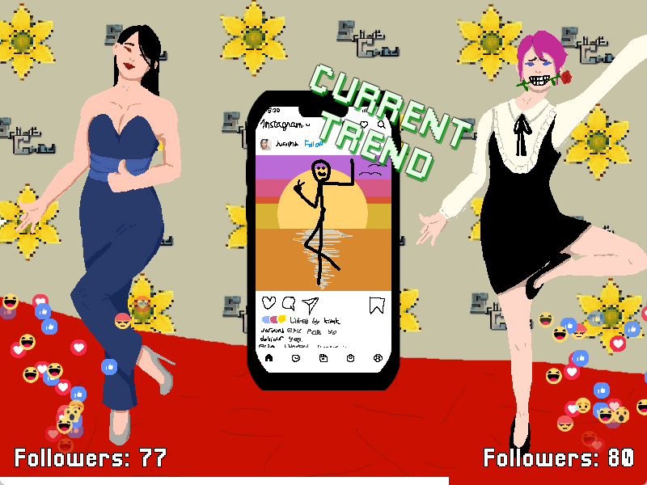
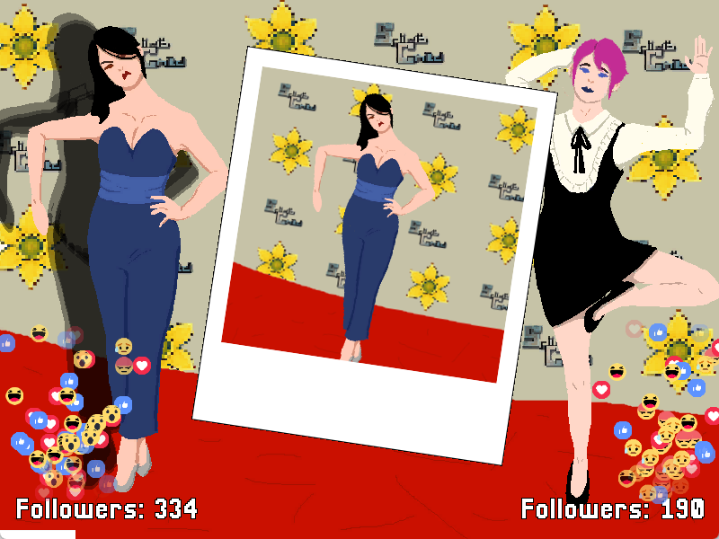
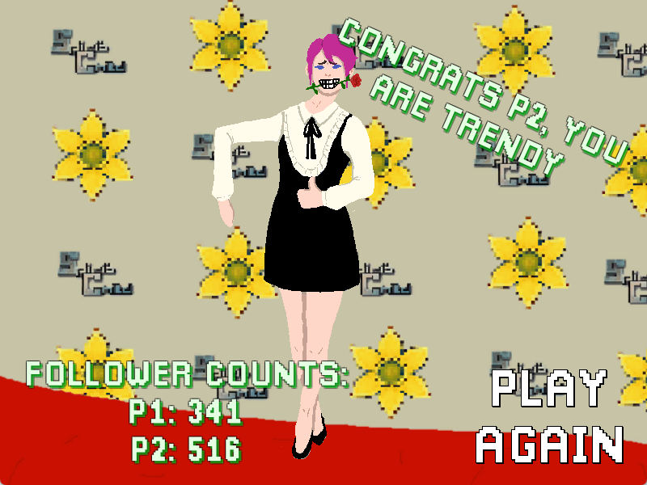

SUMMER Runway is a short but fun competitive local multiplayer game made in Unity where players compete against each other to quickly match the "current trend" displayed on screen. It can be downloaded from [itch.io here](https://lavendersalmon.itch.io/summer-runway). 

